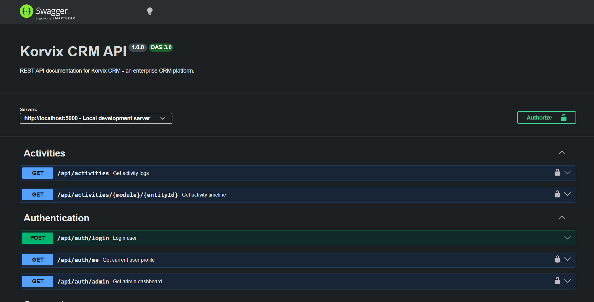
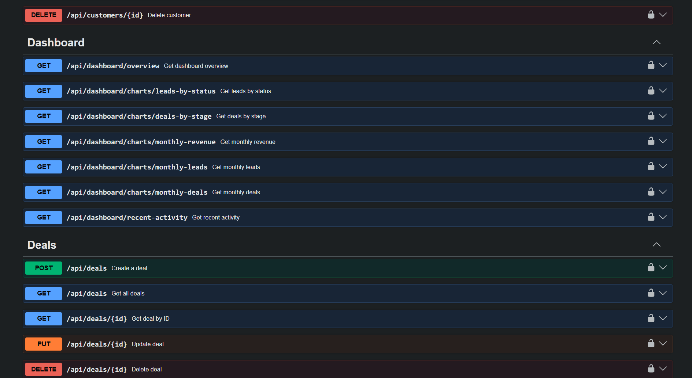
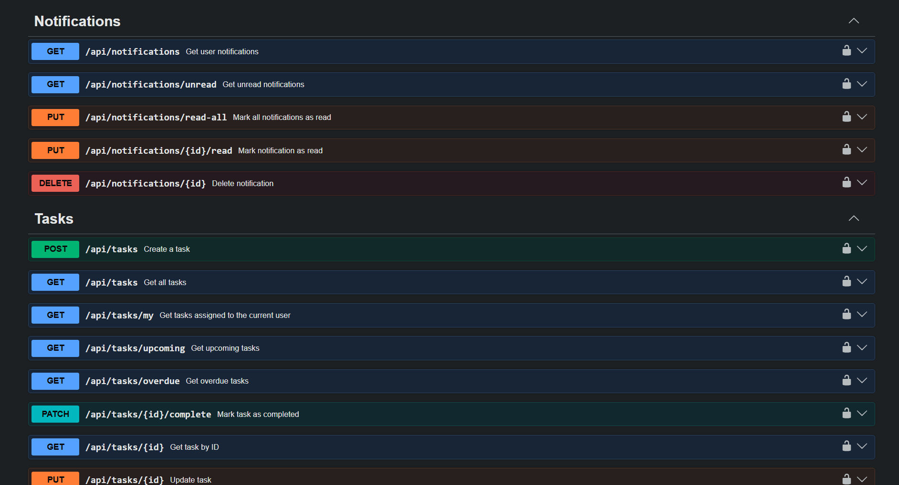
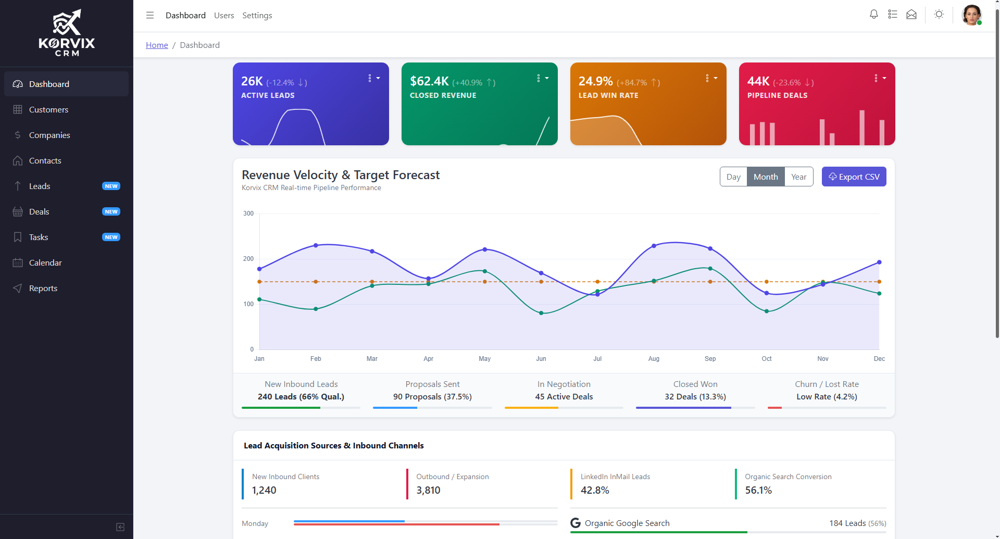
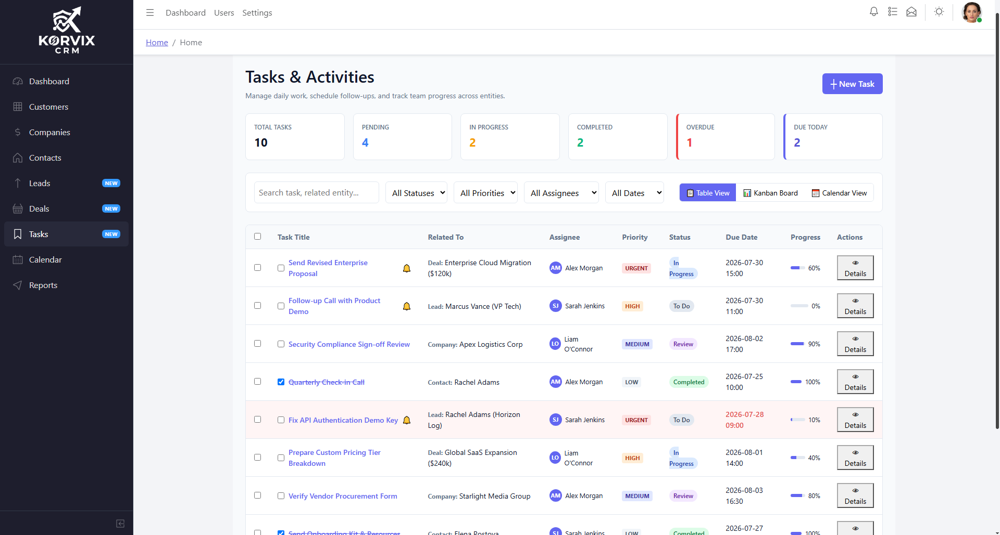
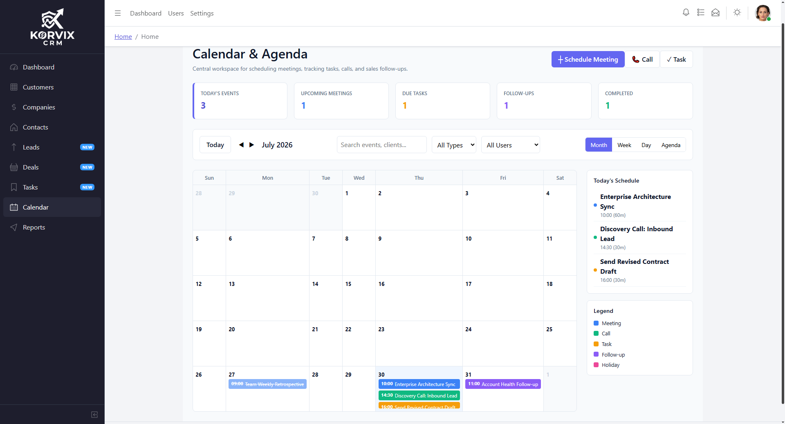

<div align="center">

# 🚀 Korvix CRM

### Modern Enterprise CRM built with Angular & Node.js

A scalable, enterprise-grade Customer Relationship Management (CRM) platform focused on performance, clean architecture, and modern UI.


---

### ⭐ Enterprise CRM Portfolio Project

</div>

| | |
| :--- | :--- |
| **⭐ Backend Live** | https://korvix-crm-backend.vercel.app/ |

# 📸 Project Preview

## Swagger API Endpoints



---


---


---

## Dashboard



---

## Notification (SOCKET.IO)


---

## Leads


---

## Tasks



---

## Calendar



---

## Reports


---

# ✨ Features

### Dashboard
- Business KPIs
- Revenue Analytics
- Customer Analytics
- Sales Charts
- Recent Activities
- Quick Actions

### CRM

- Customers
- Companies
- Contacts
- Leads
- Deals
- Tasks
- Calendar
- Reports

### Authentication

- Login
- Register
- JWT Authentication
- Role Based Access (Planned)

### Analytics

- Revenue Reports
- Sales Reports
- Team Performance
- Customer Growth
- Export Reports

---

# 🛠 Tech Stack

## Frontend

- Angular
- TypeScript
- RxJS
- CoreUI
- Bootstrap
- SCSS

## Backend

- Node.js
- Express.js
- MongoDB
- Mongoose
- JWT
- REST API

## Tools

- Git
- GitHub
- VS Code
- Postman
- Figma

---

# 📂 Folder Structure

```text
src
│
├── app
│   ├── core
│   ├── shared
│   ├── layout
│   ├── services
│   ├── guards
│   ├── interceptors
│   ├── models
│   ├── components
│   └── views
│       ├── dashboard
│       ├── customers
│       ├── companies
│       ├── contacts
│       ├── leads
│       ├── deals
│       ├── tasks
│       ├── calendar
│       └── reports
```

---

# 🚀 Getting Started

Clone Repository

```bash
git clone https://github.com/syedusamaali-dev/Korvix-CRM-2.0.git
```

Open Project

```bash
cd Korvix-CRM-2.0
```

Install Dependencies

```bash
npm install
```

Run Project

```bash
npm run start
```

Open

```
http://localhost:4200
```

---

# 🗺 Development Roadmap

## Phase 1

- ✅ Angular Setup
- ✅ CoreUI Integration
- ✅ Dashboard Layout

## Phase 2

- ⏳ Customers
- ⏳ Companies
- ⏳ Contacts
- ⏳ Leads
- ⏳ Deals
- ⏳ Tasks
- ⏳ Calendar
- ⏳ Reports

## Phase 3

- Authentication
- JWT
- Roles & Permissions
- Backend APIs

## Phase 4

- MongoDB
- Dashboard Analytics
- File Upload
- Notifications

## Phase 5

- AI Assistant
- AI Lead Scoring
- AI Report Generator
- AI Email Writer

## Phase 6

- Docker
- CI/CD
- Deployment
- Production Release

---

# 🚀 Future Features

- AI Chat Assistant
- Voice Commands
- AI Meeting Notes
- AI Email Generator
- AI Lead Prediction
- Activity Timeline
- Audit Logs
- Dark Mode
- Notifications
- Email Integration
- SMS Integration
- Responsive Mobile App
- Multi-language Support

---

# 🤝 Contributing

Contributions are welcome.

1. Fork the repository
2. Create a feature branch
3. Commit your changes
4. Push your branch
5. Open a Pull Request

---

# 📄 License

Licensed under the MIT License.

---

# 👨‍💻 Author

### Usama Ali

GitHub

https://github.com/syedusamaali-dev

---

## ⭐ If you like this project, don't forget to Star the repository!
